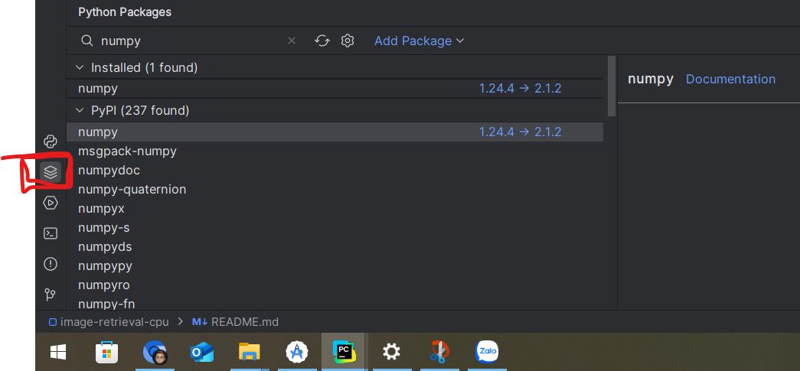
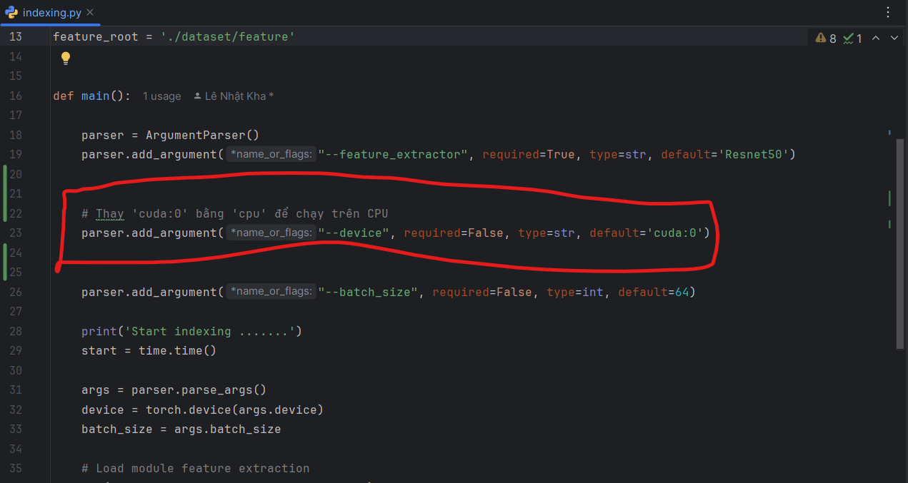

# Link github gốc

https://github.com/KhaLee2307/image-retrieval


### Yêu cầu thư viện

```

python 3.8
torch 2.4.1
torchaudio 2.4.1
torchvision 0.19.1
numpy 1.24.4
faiss (faiss-cpu đối với máy chỉ chạy trên cpu không có card NVIDIA )
(lưu ý: Chỉ cài faiss hoặc faiss-cpu)

Ngoài ra 

opencv-python
scikit-image
streamlit
streamlit-cropper

```

Các thư viện bên trên có thể cài bằng ``` python packages ``` có sẵn trong pycharm



### Configuration

#### Đối với máy không có GPU NVIDIA

- Cài thư viện faiss-cpu (1.8.0)
- Thay 'cuda:0' bằng 'cpu' để chạy trên CPU trong file indexing.py và demo.py


#### Đối với máy có GPU NVIDIA
- Cài thư viện faiss 

```
 Chỉ cài 1 trong 2 thư viện faiss hoặc faiss-cpu tùy theo cấu hình máy tính
```

### Chạy phần mềm 
Copy tất cả ảnh vào thư mục dataset/photos

Chạy file running.bat (Đối với window)

Mở trình duyệt
http://localhost:8501/


### Nếu lỗi

Thử xóa đoạn sau trong demo.py
```angular2html
import os
os.environ["KMP_DUPLICATE_LIB_OK"]="TRUE"
st.set_page_config(layout="wide")
```

